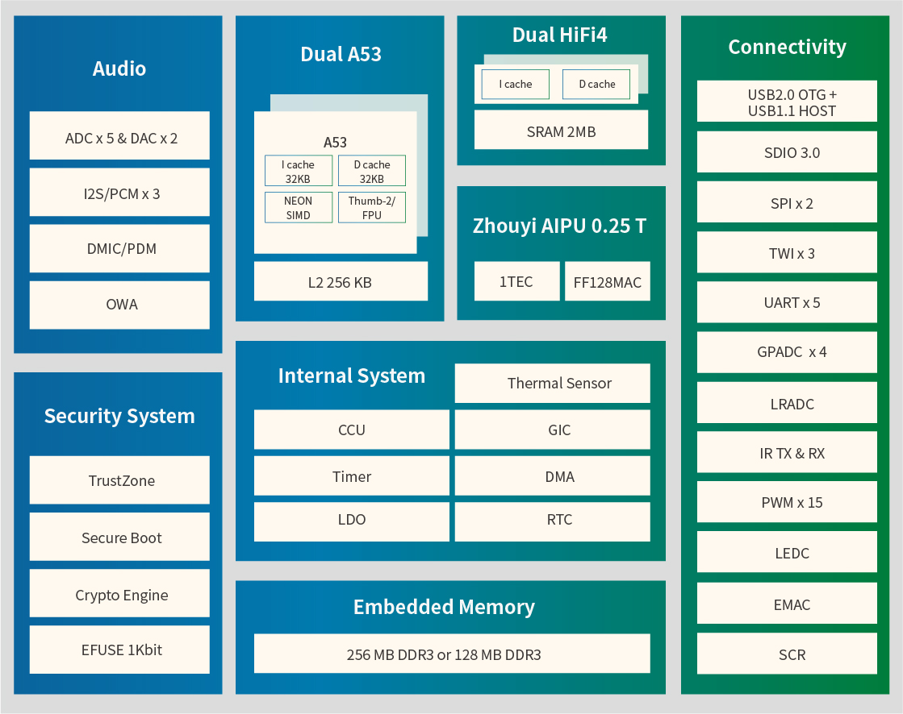

# [R329](https://github.com/SoCXin/R329)

* [allwinnertech](https://www.allwinnertech.com/)：[Cortex-A53](https://github.com/SoCXin/Cortex-M3)
* [L7R6](https://github.com/SoCXin/Level)：1500 MHz

## [简介](https://github.com/SoCXin/R329/wiki)

### 关键特性

* ARM Cortex-A53 Dual Core

### [资源收录](https://github.com/SoCXin)

* [参考资源](src/)
* [参考文档](docs/)
* [参考工程](project/)
* [入门文档](https://docs.soc.xin/R329)

### [选型建议](https://github.com/SoCXin)

[R329](https://www.allwinnertech.com/index.php?c=product&id=91) AI语音专用芯，以智能音箱作为切入点

### [探索芯世界 www.SoC.xin](http://www.SoC.Xin)
